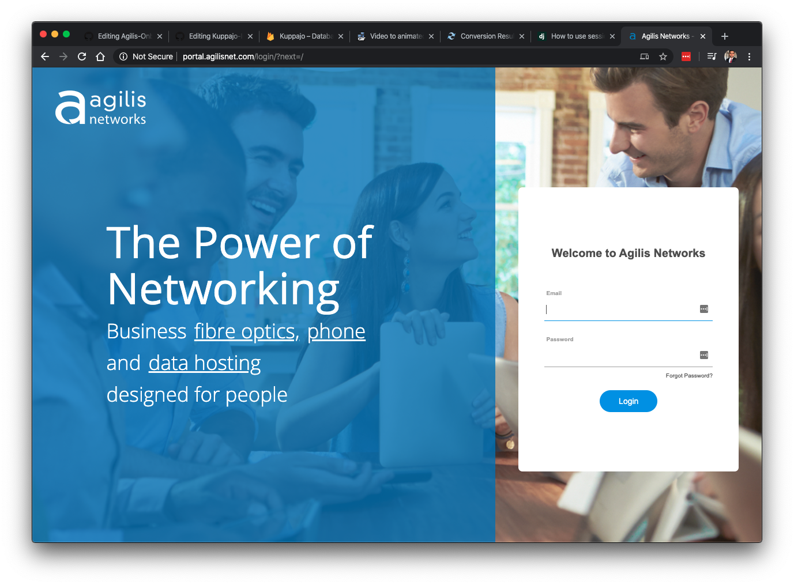
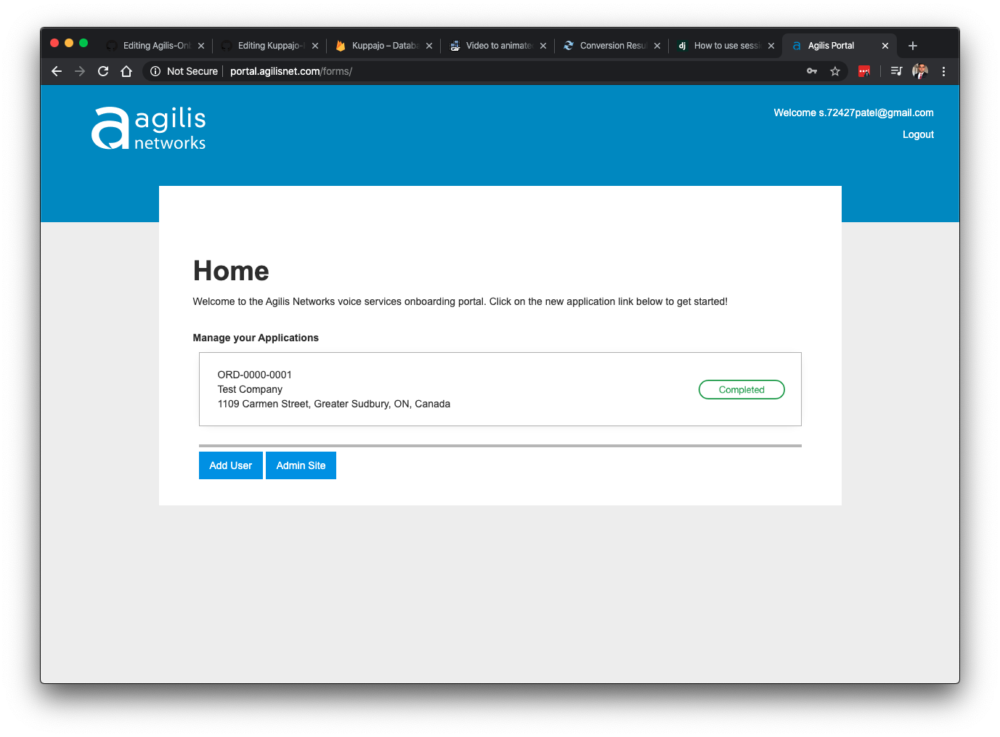
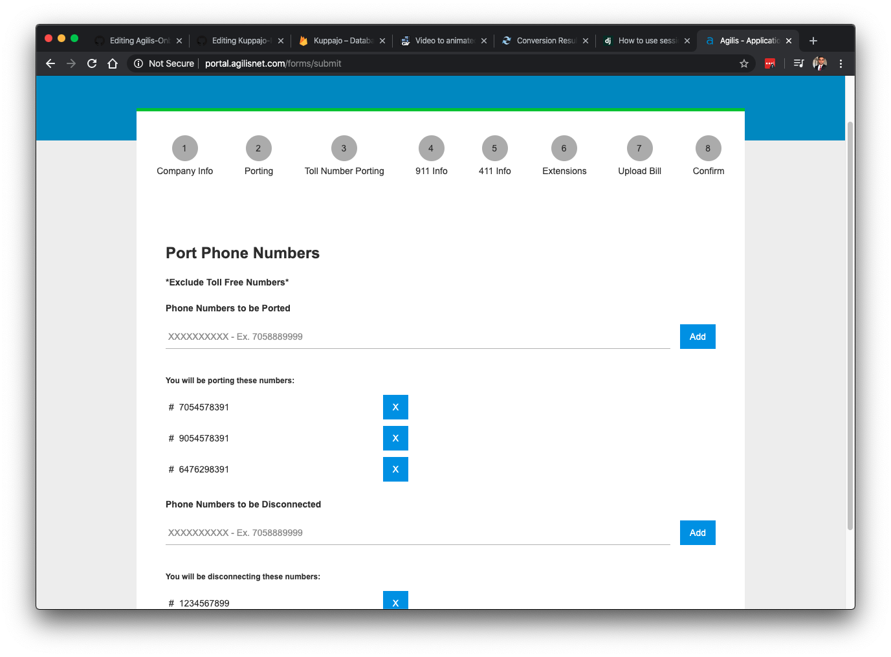
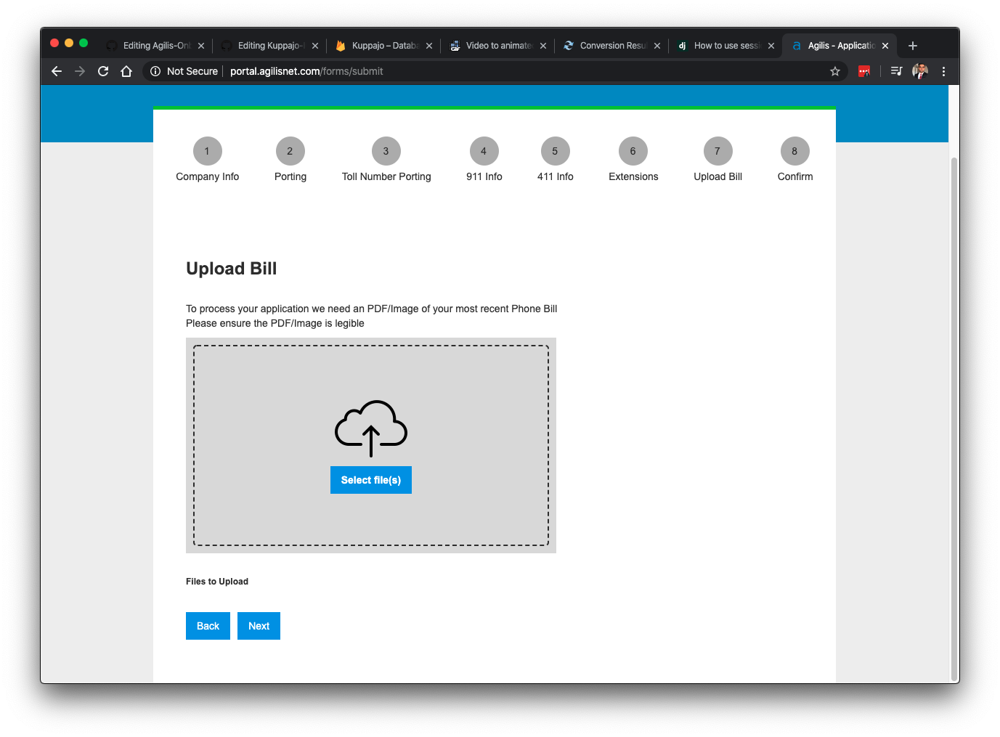

# Agilis-Onboarding-Platform

This Website was developed to establish a Client Onboarding Program that allows new clients to view outstanding applications, helps users submit their applications and view its status.

Developed using the Django Framework, MySQL for Backend Database, HTML & CSS for Templates and Javascript to manage DOM elements and pass data

Key Components included in Website: 
- Login Screen with Authentication: Uses 'Session Engine' to authenticate and keep users logged in
- Database calls via MySQL
- Creating HTML Elements via Javascript
- Using Javascript to manage DOM elements
- Creating custom classes for Users and Application Data
- Generating e-signitures on type
- Sending emails to notify staff on application status changes

<a href="http://portal.agilisnet.com/login/?next=/">Check out the website</a>
Sorry access limited to Client only

Screenshots:

